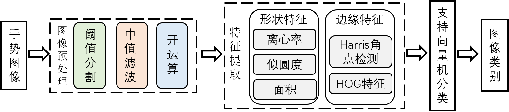
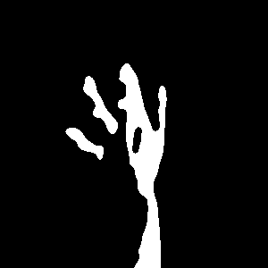
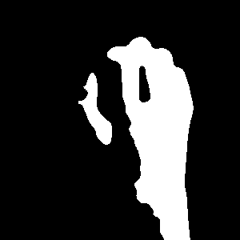
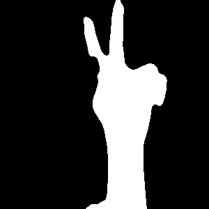
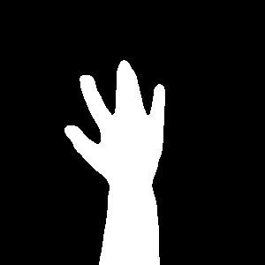
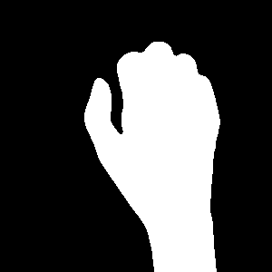

本文为人工智能课程设计的第一道题目，内容为手势图像(剪刀石头布图像)的识别与分类，收到数据集数量和大小的限制，本文中只提供了若干张图片用于训练，完整的训练数据集下载链接[如下](https://storage.googleapis.com/laurencemoroney-blog.appspot.com/rps.zip)。所用到的测试数据为部分自采图像与部分测试图像，这里同样只展示一小部分。如图为部分训练图像。

<figure >
<center>

</center>
</figure>

## 模型框架
本文中所采用的模型框架如下图所示：

<figure>
<center>

</center>
</figure>

### **图像预处理**
在图像预处理中，若直接对灰度图像进行阈值分割，尽管可以得到手势掩膜图像，但由于不同图像光线、肤色的差异，效果不够稳定，部分结果如下所示。

<figure >
<center>

</center>
</figure>

因此本方法中首先对原图像进行颜色空间转换至HSV颜色空间，并对其进行去噪与阈值分割处理获取掩膜图像，结果如下图所示，效果十分理想。

<figure >
<center>

</center>
</figure>

### **特征提取**
在特征方面，主要提取了形状和边缘特征，形状特征主要为手势面积、似圆度和离心率，边缘特征主要包括了Harris角点的数量和HOG特征。如下图所示，可见角点主要集中在指尖与指缝，基本与手指数量呈正相关，可以很好地描述本问题涉及到的三种手势；而HOG特征在指尖部分更加密集，同样有利于手势特征的表达。

<figure>
<center>

</center>
</figure>


## 内容简介

```
gesture_recognize_utils中包含了所需的所有函数
```
```
create_feature_vectors用于生成图像的特征向量文件，为features.csv
```
```
classfication中包含了svm分类器的训练和验证
```
```
test为包括自采数据在内的测试数据验证
```
```
demo.ipynb为演示所用文件，其内容完全被其他文件所包含，仅作为演示使用。
```
## 分类结果

对原始数据进行特征提取操作后，按照75%和25%的比例划分为训练集和验证集，并通过支持向量机进行训练与分类，在训练集和验证集上分别达到了**98.2%**和**95.4%**，同时，在15张测试数据上的准确率达到了100%。详细的训练及分类过程可见[演示文件](./demo.ipynb)。